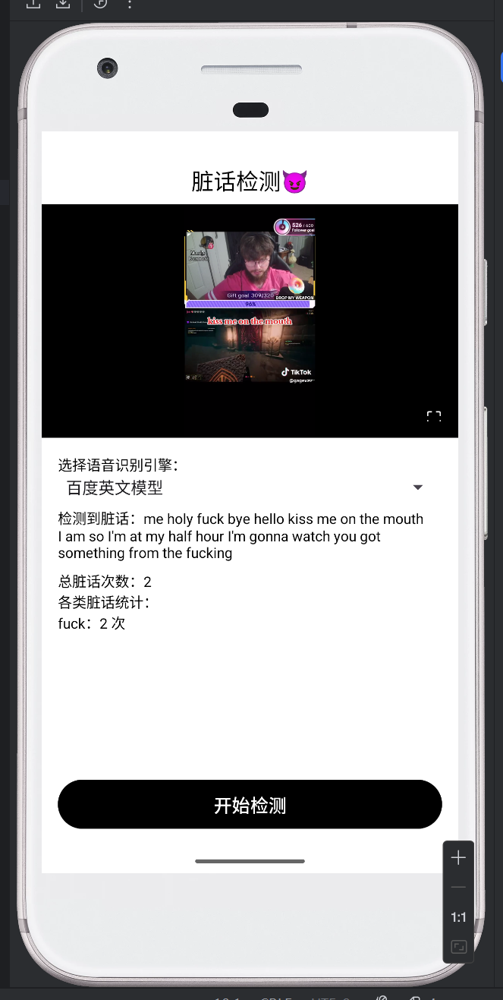

# CursingDetector —— 本地视频脏话检测 Demo（Android / Java）

本项目为 **客户端训练营 - 作业二：CursingDetector 视频脏话检测 Demo**。

实现了一条完整的处理链路：

> **本地视频文件 → 提取音轨 → 语音转文字（多种引擎可切换） → 英文脏话检测 →
> 高亮展示脏话片段 + 统计结果**

---

## ✨ 功能特性（Features）

### 1. 本地视频播放（ExoPlayer）

* 选择任意本地 mp4 视频进行分析；
* 支持：

  * 暂停/播放
  * 进度条调节
  * 缓冲提示
  * 竖屏观看自适应
  * **沉浸式全屏播放（单 Activity 实现）**

---

### 2. 多语音识别模型支持（STT Engine Switcher）

通过统一的 `SpeechToTextEngine` 接口，支持多引擎：

| 引擎类型              | 支持语言  | 特点           |
| ----------------- | ----- | ------------ |
| **Baidu English** | 英文    | 识别准确、稳定、延迟低  |
| **Baidu Chinese** | 中文普通话 | 中文识别优秀       |
| **OpenAI WhistleAPI**   | 任意    | 功能最强，但由于网络通信+接口付费在此仅作接口预留 |
| **Fake Engine**   | --    | 模拟生成结果用于调试 |

UI 允许用户在检测前自由切换识别引擎。

---

### 3. 视频音频抽取与转换（AudioExtractor）

* 使用 `MediaExtractor + MediaCodec` 抽取 AAC 等音频；
* 实时转码为：

  * **16kHz**
  * **Mono**
  * **16bit PCM**
* 生成标准 **wav** 文件（44字节头部自动回填）

保证所有 STT 引擎都能正常处理音频。

---

### 4. 脏话检测（Profanity Detector）

采用“正则规则 + 词形处理 + 中文适配”的双语脏话库：

#### 英文支持

* fuck / fucking / fuckin
* shit / shitty
* hell
* damn
* bastard
* bitch(es)
* asshole(s)
* motherfucker …

#### 中文支持

* 卧槽 / 我艹
* 傻逼 / 傻B / 沙币
* 操你妈 / 草泥马
* 垃圾(队友)
* 妈的 / 他妈的
* 滚你妈
* 臭傻逼 …

确保不误报（如 hello → hell）、不漏报（如 fucking → fuck）。

---

### 5. 命中明细 + 自动静音

* 页面展示每次脏话命中的：

  * 脏话种类
  * 起止时间
  * 原始文本
* 点击某条命中 → 自动跳转到视频对应时间段；
* （可扩展支持）自动静音该段时间。

---

### 6. UI / UX 完整体验

* 固定底部“开始检测”按钮，重要操作不会被挤下去；
* 下半部分采用 `ScrollView`，不会压缩播放器；
* Toolbar 标题居中；
* 全屏按钮动态伸缩播放器区域；
* 多语言识别提示 + 状态显示。

---

## 🏛 架构设计（Architecture）

本项目采用 **自定义接口抽象 + 工具类模块化** 的轻量工程结构：

```
UI 层（MainActivity）
    ↓ 调用
SpeechToTextEngine（可插拔接口）
    ↓ 实现
 - BaiduSpeechToTextEngine（英文）
 - BaiduSpeechToTextEngine（中文）
 - FakeSpeechToTextEngine
（未来可加：XunfeiSpeechToTextEngine / AliyunEngine）

    ↓ 调用
AudioExtractor（统一音频处理）
    ↓ 输出 wav
Baidu / Future STT Engine

    ↓ 返回文本（含时间戳/无时间戳）
ProfanityDetector → 正则匹配
ProfanityStats → 数据汇总
RecyclerView（明细展示）
```


---

## 📂 项目结构（Project Structure）

```text
app/src/main/java/com/example/cursingdetector
│
├── model/
│   ├── ProfanityHit.java           # 单次脏话命中信息
│   └── TranscriptSegment.java      # 一段识别后的语音文本
│
├── profanity/
│   ├── ProfanityDetector.java      # 正则规则驱动的英文脏话检测器
│   └── ProfanityStats.java         # 统计与摘要生成
│
├── stt/                            # Speech To Text 模块
│   ├── SpeechToTextEngine.java     # 抽象接口
│   ├── FakeSpeechToTextEngine.java # 本地模拟引擎（无需网络）
│   ├── BaiduAuth.java              # 获取 Baidu access_token
│   ├── BaiduSpeechToTextEngine.java# 调用 Baidu 语音识别 REST API
│   └── CloudSpeechToTextEngine.java# 调用 OpenAI Whisper 接口
│
├── ui/
│   └── player/
│       ├── MainActivity.java       # 唯一 Activity，负责 UI + 流程协调
│       └── ProfanityHitAdapter.java# RecyclerView 适配器
│
└── util/
    ├── AudioExtractor.java         # 提取音轨 & 解码为 PCM
    └── WavHeaderPatcher.java       # 补写 WAV 文件头
```

资源文件结构（简略）：

```text
app/src/main/res
├── layout/
│   ├── activity_main.xml           # 主界面布局（播放器 + 状态 + 列表）
│   └── item_profanity_hit.xml      # 脏话记录列表单行布局
├── values/
│   ├── strings.xml                 # 文案字符串（app 名等）
│   ├── colors.xml                  # 主题颜色
│   ├── themes.xml                  # 主题样式
│   └── arrays.xml                  # 引擎名称数组（Spinner 用）
└── mipmap-*/ & drawable/           # 图标资源
```

---

## 🔧 技术栈（Tech Stack）

| 技术                          | 用途           |
| --------------------------- | ------------ |
| Java + Android View         | 主 UI 开发      |
| ExoPlayer                   | 播放本地视频       |
| MediaExtractor + MediaCodec | 抽取音频并解码为 PCM |
| OkHttp                      | 调用百度语音 API   |
| 正则表达式 (Regex)               | 脏话检测         |
| RecyclerView                | 脏话命中列表       |
| Spinner                     | 模型选择下拉框      |
| ScrollView                  | 防挤压布局        |
| MaterialToolbar             | 顶部导航栏        |
| 自定义全屏逻辑                     | 沉浸式视频播放      |
---

## 🚀 运行方式（How to Run）

1. 克隆项目
2. Android Studio 打开项目
3. 连接模拟器/真机
4. 点击 **Run（▶）**
5. 选择任意本地 mp4 视频 → 选择模型 → 点击「开始检测」

你将看到：

* 视频播放
* STT 实时识别文本
* 自动检测脏话
* 统计数和命中列表
* 点击命中跳转视频对应位置

---

## 📷 截图展示（Screenshots）



---

## 🐛 关键问题与解决（Debug Notes）

### 1. 视频黑屏

→ HEVC 解码不支持 + PlayerView 配置问题

**解决：使用 SurfaceView 渲染 + resize_mode="fit"**

### 2. OpenAI STT 全部失败

→ 模拟器流量无法走 VPN，被墙

**解决：换百度短语音作为主要模型**

### 3. 百度返回 3310（音频太长）

→ 抽取后 PCM 体积过大

**解决：统一重采样为 16kHz Mono PCM**

### 4. RecyclerView 内容撑开布局

→ 内容过多挤压播放器

**解决：下半部分放入 ScrollView**

### 5. Toolbar 太高 / 标题不居中

→ Material 默认值太大

**解决：height 调为 48dp + titleCentered=true**

### 6. 全屏按钮不能显示

→ 使用了系统私有图标

**解决：改为“⛶”字符按钮，全屏逻辑完全自定义**

### 7. 脏话误报（hello → hell）

→ substring 逻辑太粗糙

**解决：使用正则 + 单词边界**

### 8. 中文脏话库缺失

→ 百度中文模型返回中文后检测不到

**解决：加入中文脏词规则**

---

## 🧭 后续扩展方向（Future Work）

* 接入讯飞 / 阿里云真实 STT（已预留接口）
* 换成 OpenAI Whisper 本地（on-device）推理（如使用 GGML）
* 导出视频 + 自动打码/静音功能
* 添加敏感词自定义编辑
* 自动字幕生成与叠加
* 小窗视频 / 悬浮播放

---
## 📄 License

Copyright © 2025 LovienWee.

本项目采用 **GPL v3** 开源协议。

这意味着你可以自由使用、修改和分发本软件，但任何基于本项目的衍生作品也必须以相同的开源方式发布。

详见 [LICENSE](LICENSE) 文件。